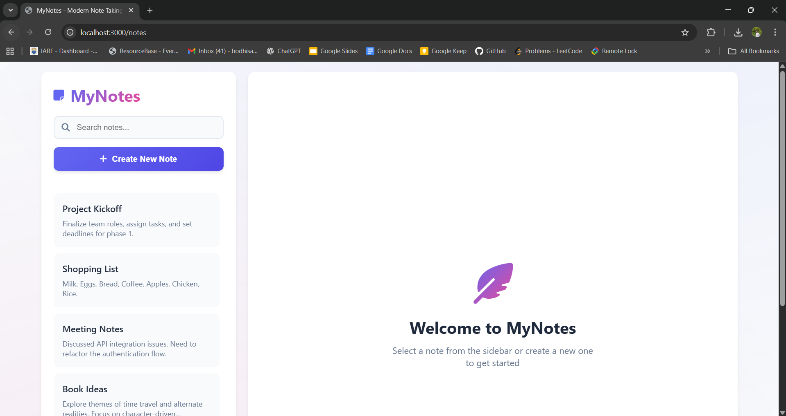
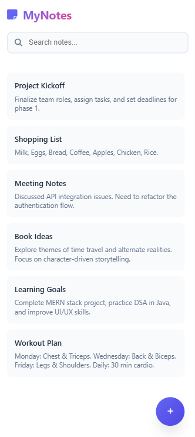
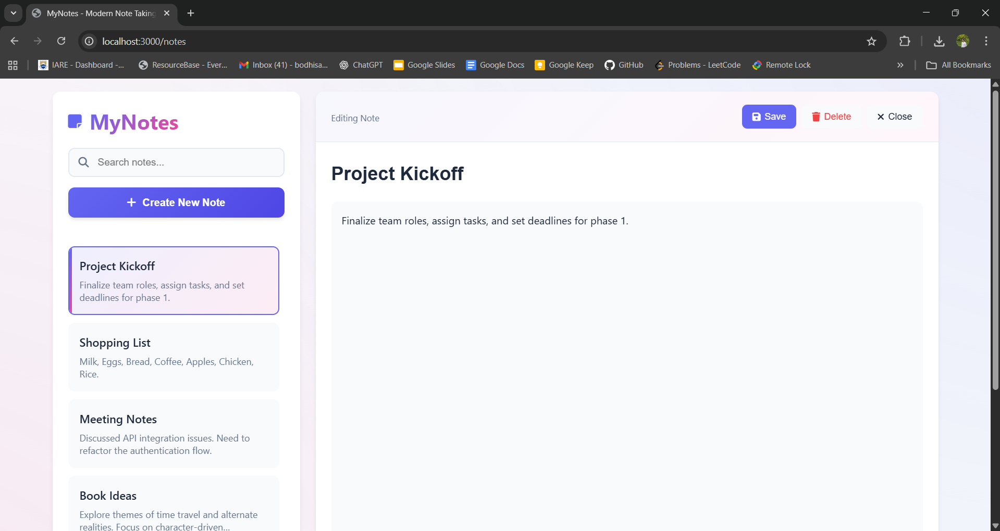

# 📝 MyNotes - Modern Note Taking App  

A full-stack **Note-Taking Web Application** built with **Node.js, Express.js, MongoDB, and Vanilla JavaScript**.  
Easily create, edit, delete, and manage your notes with a beautiful, responsive interface that works seamlessly across all devices.  

---

## ✨ Features  

- 📝 **Create Notes** – Add new notes with title and content  
- ✏️ **Edit Notes** – Modify existing notes anytime  
- 🗑️ **Delete Notes** – Remove unwanted notes with confirmation  
- 🔍 **Search Functionality** – Quickly find notes by title or content  
- 📱 **Fully Responsive** – Optimized for desktop, tablet, and mobile  
 
- ⌨️ **Keyboard Shortcuts**:  
  - `Ctrl/Cmd + S` → Save current note  
  - `Ctrl/Cmd + N` → Create new note  
  - `ESC` → Close editor  
- 🎨 **Modern UI/UX** – Smooth transitions, hover effects, and responsive drawer sidebar  

---

## 📂 Project Structure  

```
NOTES-WEBAPP/
│
├── models/
│   └── notesSchema.js       # Mongoose schema for notes
│
├── public/                  # Static frontend files
│   ├── script.js
│   └── style.css
│
├── routes/
│   └── notes.js             # Express routes for CRUD operations
│
├── views/                   # EJS templates
│   ├── index.ejs
│   └── notes.ejs
│
├── .env                     # Environment variables
├── .gitignore
├── main.js                  # Express server entry point
├── package.json
├── package-lock.json
└── README.md
```

---

## ⚙️ Setup & Installation  

### Prerequisites  
- [Node.js](https://nodejs.org/)  
- [MongoDB](https://www.mongodb.com/)  
- [Git](https://git-scm.com/)  

### 1. Clone the repository  
```bash
git clone https://github.com/Bodhisattva-Duduka/Notes-Webapp.git
cd Notes-Webapp
```

### 2. Install dependencies  
```bash
npm install
```

### 3. Create `.env` file  
```env
PORT=3000
MONGO_URI=your_mongodb_connection_string
```

### 4. Run the server  
```bash
# Development mode
npm run dev
```

Server runs at: 👉 [http://localhost:3000](http://localhost:5000)  

---

## 🛠 Tech Stack  

### Frontend  
- **HTML5** – Semantic markup  
- **CSS3** – Modern styling & responsive design  
- **JavaScript (Vanilla)** – Dynamic UI, fetch API  
- **Font Awesome** – Icons  

### Backend  
- **Node.js** – Runtime environment  
- **Express.js** – Web framework  
- **MongoDB** – NoSQL database  
- **Mongoose** – ODM for MongoDB  
- **EJS** – Templating engine  

### Tools  
- **Git & GitHub** – Version control  
- **npm** – Package management  
- **dotenv** – Secure environment variables  

---


### Example Note Object  
```json
{
  "id": "1756835809958",
  "title": "Meeting Notes",
  "noteBody": "Discuss project timeline and deliverables..."
}
```

---

## 🎨 Features Breakdown  

### 🖥 Desktop View  
- Split-screen interface (sidebar + editor)  
- Real-time note loading  
- Smooth hover effects & transitions  

### 📱 Mobile View  
- Full-screen editor  
- Responsive sidebar drawer  
- Touch-friendly UI with large buttons  

---

## 📸 Screenshots  

### Desktop View  
  

### Mobile UI  
  

### Note Editor  
  

---
---

## 📄 License

This project is licensed under the [MIT License](./LICENSE) - see the LICENSE file for details.